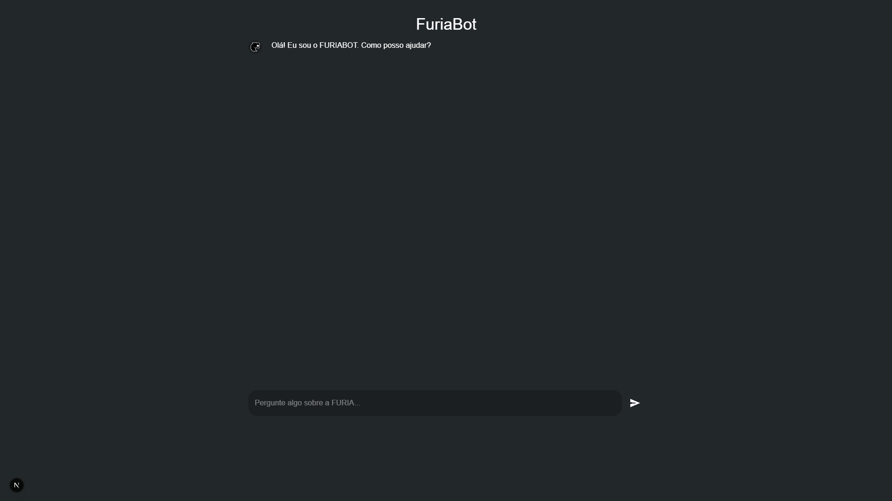

# 🤖 FuriaBot Chat

Uma interface moderna, interativa e responsiva para o chatbot oficial da FURIA, construída com **Next.js 15**, **Material UI (MUI)** e integração com um **bot de IA via API**.



---

## 🚀 Tecnologias Utilizadas

- [Next.js 15](https://nextjs.org/docs)
- [Material UI (MUI)](https://mui.com/)
- [Axios](https://axios-http.com/)
- [TypeScript](https://www.typescriptlang.org)

---

## 🧠 Funcionalidades

- Interface estilo ChatGPT
- Animações de digitação do bot
- Scroll automático para a última mensagem
- UI personalizada com design clean e escuro
- Avatar para bot (com logo da FURIA)
- Comunicação com o back-end
- Totalmente responsivo

---

## 🔧 Como rodar o projeto

### 1. Clone o repositório

```bash
git clone https://github.com/drypzz/FuriaBot-Chat.git
cd FuriaBot-Chat
